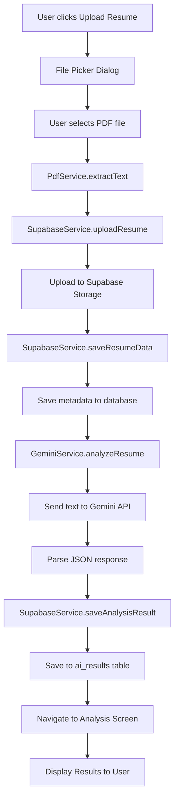
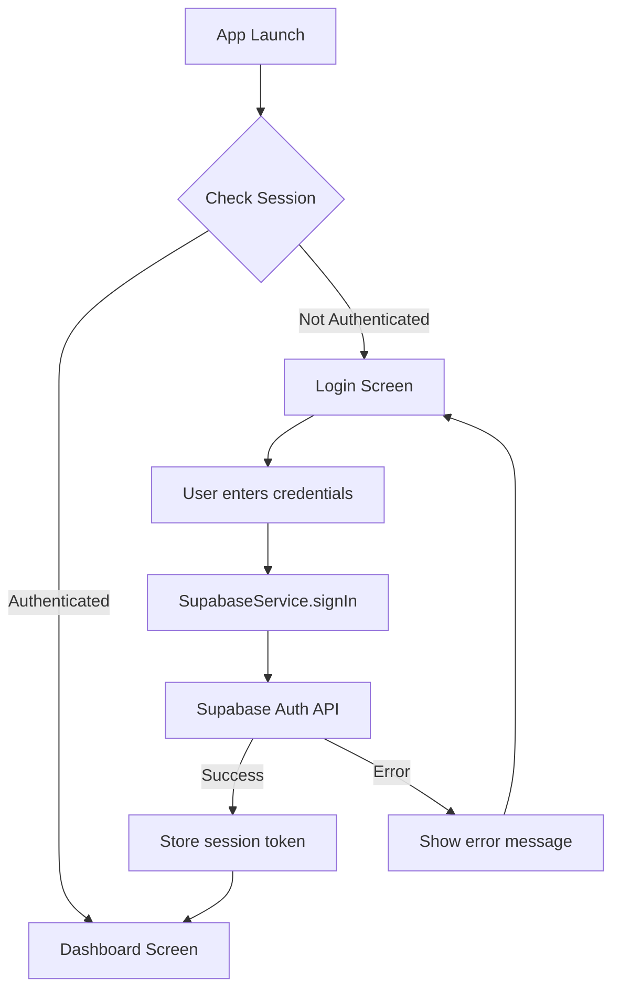
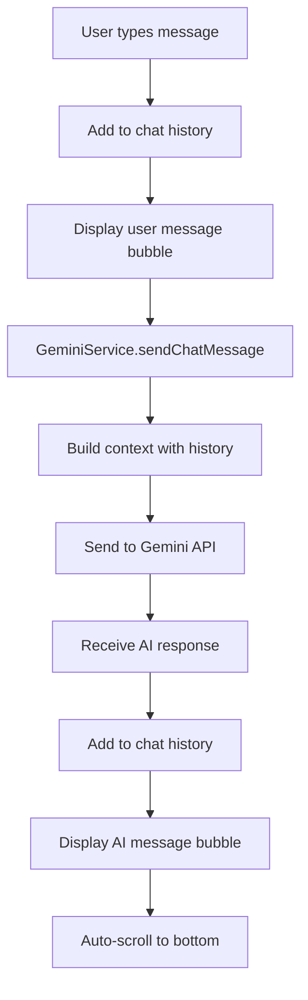
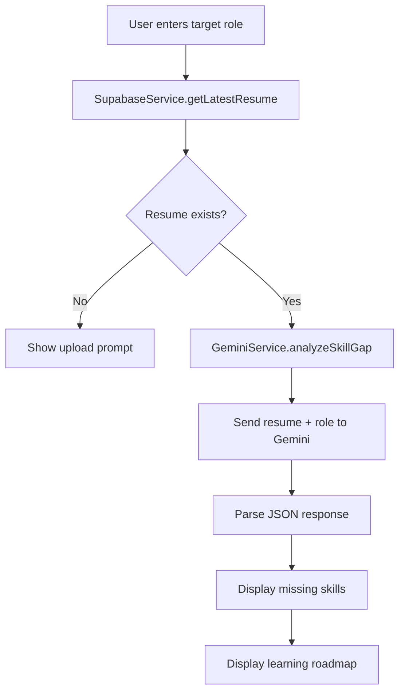

# AI Career Coach - Project Architecture

## 1️⃣ Project Overview

**AI Career Coach** is a 100% free, AI-powered Flutter desktop application designed to help job seekers improve their resumes and advance their careers. The app provides intelligent resume analysis, skill gap identification, and personalized career guidance through an AI chat assistant.

### Core Features

- **Resume Analysis**: Upload PDF resumes and receive AI-powered feedback including scores, strengths, weaknesses, and ATS compatibility assessment
- **Skill Gap Analysis**: Identify missing skills for target roles and get personalized learning roadmaps
- **AI Career Chat**: Interactive chat assistant for career advice and guidance
- **User Authentication**: Secure email/password authentication with persistent sessions
- **Resume Storage**: Cloud storage for uploaded resumes and analysis history

### Target Platform

- **Primary**: Windows Desktop (Flutter for Windows)
- **Future Support**: Can be extended to macOS, Linux, Web, iOS, and Android

---

## 2️⃣ Tech Stack

### Frontend

- **Framework**: Flutter 3.x (Dart SDK >=3.0.0 <4.0.0)
- **State Management**: Provider pattern with singleton services
- **UI Library**: Material Design 3 with custom theming
- **UI Enhancements**:
  - `glassmorphism_ui` - Glassmorphic UI components
  - `google_fonts` - Modern typography
  - `flutter_animate` - Smooth animations

### Backend

- **BaaS**: Supabase (Free Tier)
  - **Authentication**: Email/password auth with session management
  - **Database**: PostgreSQL for user profiles, resumes, and analysis results
  - **Storage**: File storage for resume PDFs
- **Environment Config**: `flutter_dotenv` for API key management

### AI Layer

- **Provider**: Google Gemini API (Free Tier)
- **Model**: Gemini 2.5 Flash (primary) with auto-discovery fallback
- **Fallback Chain**: 
  1. `gemini-2.5-flash` on `v1beta`
  2. `gemini-2.5-flash` on `v1`
  3. `gemini-2.0-flash` on `v1beta`
- **Why Gemini 2.5 Flash**: 
  - 100% free tier with generous quota
  - Fast response times
  - Strong text analysis capabilities
  - No credit card required

### Additional Libraries

- **PDF Processing**: `syncfusion_flutter_pdf` - Extract text from PDF files
- **File Picking**: `file_picker` - Native file selection dialogs
- **Local Storage**: `shared_preferences` - Theme preferences and local settings
- **Utilities**: `intl` (formatting), `uuid` (ID generation)

---

## 3️⃣ API Usage

### Google Gemini API

**Purpose**: Powers all AI features including resume analysis, skill gap analysis, and chat responses.

**Configuration**:
- **API Key Storage**: `.env` file (not committed to git)
- **Key Variable**: `GEMINI_API_KEY`
- **Service File**: [`lib/services/gemini_service.dart`](file:///c:/Users/HP/.gemini/antigravity/scratch/ai_career_coach/lib/services/gemini_service.dart)

**Request Flow**:
```
User Action (Upload/Chat)
  ↓
Screen Layer (resume_upload_screen.dart, chat_screen.dart, skill_gap_screen.dart)
  ↓
GeminiService._callApi(prompt)
  ↓
Auto-Discovery: Try multiple model/version combinations
  ↓
HTTP POST to generativelanguage.googleapis.com
  ↓
Parse JSON response
  ↓
Return structured data to UI
```

**Features Using Gemini**:

1. **Resume Analysis** (`analyzeResume`)
   - Input: Extracted resume text
   - Output: JSON with score, strengths, weaknesses, ATS compatibility, suggestions
   - Called from: `resume_upload_screen.dart`

2. **Skill Gap Analysis** (`analyzeSkillGap`)
   - Input: Resume text + target role
   - Output: JSON with missing skills and learning roadmap
   - Called from: `skill_gap_screen.dart`

3. **Career Chat** (`sendChatMessage`)
   - Input: User message + conversation history
   - Output: AI assistant response text
   - Called from: `chat_screen.dart`

4. **Career Suggestions** (`generateCareerSuggestions`)
   - Input: Resume text
   - Output: Array of potential career paths
   - Called from: `resume_analysis_screen.dart`

**Error Handling**:
- Auto-retry with different model versions on 404/500 errors
- Quota limit detection (429 errors)
- JSON parsing with markdown fence removal
- User-friendly error messages

---

### Supabase API

**Purpose**: Backend-as-a-Service for authentication, database, and file storage.

**Configuration**:
- **API Keys Storage**: `.env` file
- **Key Variables**: 
  - `SUPABASE_URL` - Project URL
  - `SUPABASE_ANON_KEY` - Anonymous/public key
- **Service File**: [`lib/services/supabase_service.dart`](file:///c:/Users/HP/.gemini/antigravity/scratch/ai_career_coach/lib/services/supabase_service.dart)

**Features Using Supabase**:

1. **Authentication**
   - Sign Up: `signUp(email, password, fullName)`
   - Sign In: `signInWithPassword(email, password)`
   - Sign Out: `signOut()`
   - Session Management: Automatic token refresh
   - Called from: `login_screen.dart`, `signup_screen.dart`

2. **Database Operations**
   - **Tables**: `users`, `resumes`, `ai_results`
   - **User Profiles**: Store user metadata on signup
   - **Resume Metadata**: Store file info and extracted text
   - **Analysis Results**: Store AI analysis history
   - Called from: All feature screens via `SupabaseService`

3. **File Storage**
   - **Bucket**: `resumes` (configured in Supabase dashboard)
   - **Upload**: `uploadResume(file, fileName)`
   - **Path Structure**: `{userId}/{timestamp}-{fileName}`
   - Called from: `resume_upload_screen.dart`

**Request Flow**:
```
User Login/Signup
  ↓
Auth Screen (login_screen.dart)
  ↓
SupabaseService.signIn() or signUp()
  ↓
Supabase Auth API
  ↓
Store session token
  ↓
Navigate to Dashboard
```

---

## 4️⃣ Folder Structure

```
lib/
├── core/                    # Core utilities and configuration
│   ├── constants/          # App-wide constants
│   │   └── app_constants.dart
│   ├── theme/              # Theme and styling
│   │   ├── app_colors.dart
│   │   └── app_theme.dart
│   └── utils/              # Helper utilities
│       ├── auth_error_handler.dart
│       └── validators.dart
│
├── features/               # Feature modules (screens)
│   ├── auth/              # Authentication feature
│   │   └── screens/
│   │       ├── login_screen.dart
│   │       └── signup_screen.dart
│   ├── dashboard/         # Main dashboard
│   │   └── screens/
│   │       └── dashboard_screen.dart
│   ├── resume/            # Resume upload and analysis
│   │   └── screens/
│   │       ├── resume_upload_screen.dart
│   │       └── resume_analysis_screen.dart
│   ├── skill_gap/         # Skill gap analysis
│   │   └── screens/
│   │       └── skill_gap_screen.dart
│   └── chat/              # AI chat assistant
│       └── screens/
│           └── chat_screen.dart
│
├── models/                # Data models
│   ├── user_model.dart
│   ├── resume_model.dart
│   ├── analysis_model.dart
│   └── chat_message_model.dart
│
├── services/              # Business logic and API integration
│   ├── supabase_service.dart   # Supabase operations
│   ├── gemini_service.dart     # Gemini AI operations
│   ├── pdf_service.dart        # PDF text extraction
│   └── storage_service.dart    # Local storage
│
└── main.dart              # App entry point
```

### Folder Responsibilities

- **`core/`**: Shared utilities, constants, theme configuration, and validators used across the app
- **`features/`**: Feature-based organization with each feature containing its screens
- **`models/`**: Data classes for type-safe data handling
- **`services/`**: Singleton services that handle external API calls and business logic

---

## 5️⃣ File Responsibility Map

### Entry Point

#### [`main.dart`](file:///c:/Users/HP/.gemini/antigravity/scratch/ai_career_coach/lib/main.dart)
- App initialization and entry point
- Loads environment variables from `.env`
- Initializes Supabase, Gemini, and Storage services
- Determines initial route (Login vs Dashboard) based on auth state
- Sets up Material App with theme configuration

---

### Services Layer

#### [`lib/services/gemini_service.dart`](file:///c:/Users/HP/.gemini/antigravity/scratch/ai_career_coach/lib/services/gemini_service.dart)
- Singleton service for all Gemini AI operations
- **Auto-Discovery**: Tries multiple model/version combinations to handle API changes
- **Methods**:
  - `analyzeResume()` - Resume analysis with structured JSON output
  - `analyzeSkillGap()` - Skill gap analysis for target roles
  - `sendChatMessage()` - Chat with conversation history
  - `generateCareerSuggestions()` - Career path recommendations
- **Helper**: `_extractJson()` - Robust JSON parsing with markdown fence removal

#### [`lib/services/supabase_service.dart`](file:///c:/Users/HP/.gemini/antigravity/scratch/ai_career_coach/lib/services/supabase_service.dart)
- Singleton service for all Supabase operations
- **Authentication**:
  - `signUp()` - Create account and user profile
  - `signIn()` - Email/password login
  - `signOut()` - Logout and clear session
- **Resume Operations**:
  - `uploadResume()` - Upload PDF to storage
  - `saveResumeData()` - Save metadata to database
  - `getUserResumes()` - Fetch user's resume history
- **Analysis Operations**:
  - `saveAnalysisResult()` - Store AI analysis results
  - `getLatestAnalysis()` - Retrieve most recent analysis

#### [`lib/services/pdf_service.dart`](file:///c:/Users/HP/.gemini/antigravity/scratch/ai_career_coach/lib/services/pdf_service.dart)
- PDF text extraction using Syncfusion library
- Converts PDF bytes to plain text for AI analysis
- Handles PDF parsing errors gracefully

#### [`lib/services/storage_service.dart`](file:///c:/Users/HP/.gemini/antigravity/scratch/ai_career_coach/lib/services/storage_service.dart)
- Local storage using SharedPreferences
- Stores theme mode preference (dark/light)
- Can be extended for other local settings

---

### Models

#### [`lib/models/user_model.dart`](file:///c:/Users/HP/.gemini/antigravity/scratch/ai_career_coach/lib/models/user_model.dart)
- User profile data model
- Fields: id, email, fullName, createdAt
- JSON serialization/deserialization

#### [`lib/models/resume_model.dart`](file:///c:/Users/HP/.gemini/antigravity/scratch/ai_career_coach/lib/models/resume_model.dart)
- Resume metadata model
- Fields: id, userId, fileName, filePath, extractedText, uploadedAt
- Links to Supabase storage and database

#### [`lib/models/analysis_model.dart`](file:///c:/Users/HP/.gemini/antigravity/scratch/ai_career_coach/lib/models/analysis_model.dart)
- AI analysis result model
- Fields: id, resumeId, score, strengths, weaknesses, atsCompatibility, suggestions
- Represents structured Gemini API response

#### [`lib/models/chat_message_model.dart`](file:///c:/Users/HP/.gemini/antigravity/scratch/ai_career_coach/lib/models/chat_message_model.dart)
- Chat message data model
- Fields: text, isUser, timestamp
- Used for chat UI and conversation history

---

### Feature Screens

#### [`lib/features/auth/screens/login_screen.dart`](file:///c:/Users/HP/.gemini/antigravity/scratch/ai_career_coach/lib/features/auth/screens/login_screen.dart)
- Login UI with email/password fields
- Form validation using validators
- Calls `SupabaseService.signIn()`
- Navigates to Dashboard on success
- Error handling with user-friendly messages

#### [`lib/features/auth/screens/signup_screen.dart`](file:///c:/Users/HP/.gemini/antigravity/scratch/ai_career_coach/lib/features/auth/screens/signup_screen.dart)
- Signup UI with email, password, and full name fields
- Password confirmation validation
- Calls `SupabaseService.signUp()`
- Creates user profile in database
- Auto-login after successful signup

#### [`lib/features/dashboard/screens/dashboard_screen.dart`](file:///c:/Users/HP/.gemini/antigravity/scratch/ai_career_coach/lib/features/dashboard/screens/dashboard_screen.dart)
- Main dashboard after login
- Displays resume score with circular progress indicator
- Feature cards for Resume Analyzer, Skill Gap Analyzer, AI Chat
- Logout functionality
- Loads latest analysis on init

#### [`lib/features/resume/screens/resume_upload_screen.dart`](file:///c:/Users/HP/.gemini/antigravity/scratch/ai_career_coach/lib/features/resume/screens/resume_upload_screen.dart)
- File picker for PDF selection
- Extracts text using `PdfService`
- Uploads file to Supabase storage
- Sends text to Gemini for analysis
- Saves results to database
- Navigates to analysis screen

#### [`lib/features/resume/screens/resume_analysis_screen.dart`](file:///c:/Users/HP/.gemini/antigravity/scratch/ai_career_coach/lib/features/resume/screens/resume_analysis_screen.dart)
- Displays AI analysis results
- Shows score, strengths, weaknesses, ATS compatibility
- Lists improvement suggestions
- Option to generate career path suggestions

#### [`lib/features/skill_gap/screens/skill_gap_screen.dart`](file:///c:/Users/HP/.gemini/antigravity/scratch/ai_career_coach/lib/features/skill_gap/screens/skill_gap_screen.dart)
- Input field for target role
- Fetches latest resume from database
- Calls `GeminiService.analyzeSkillGap()`
- Displays missing skills and learning roadmap
- Shows priority levels and timelines

#### [`lib/features/chat/screens/chat_screen.dart`](file:///c:/Users/HP/.gemini/antigravity/scratch/ai_career_coach/lib/features/chat/screens/chat_screen.dart)
- Chat UI with message bubbles
- Maintains conversation history
- Sends messages to `GeminiService.sendChatMessage()`
- Displays AI responses in real-time
- Auto-scroll to latest message

---

### Core Utilities

#### [`lib/core/theme/app_theme.dart`](file:///c:/Users/HP/.gemini/antigravity/scratch/ai_career_coach/lib/core/theme/app_theme.dart)
- Light and dark theme definitions
- Material Design 3 configuration
- Custom color schemes

#### [`lib/core/theme/app_colors.dart`](file:///c:/Users/HP/.gemini/antigravity/scratch/ai_career_coach/lib/core/theme/app_colors.dart)
- Color palette constants
- Gradient definitions for UI elements
- Glassmorphism colors

#### [`lib/core/constants/app_constants.dart`](file:///c:/Users/HP/.gemini/antigravity/scratch/ai_career_coach/lib/core/constants/app_constants.dart)
- App-wide constants
- Supabase bucket names
- Configuration values

#### [`lib/core/utils/validators.dart`](file:///c:/Users/HP/.gemini/antigravity/scratch/ai_career_coach/lib/core/utils/validators.dart)
- Form validation functions
- Email format validation
- Password strength validation

#### [`lib/core/utils/auth_error_handler.dart`](file:///c:/Users/HP/.gemini/antigravity/scratch/ai_career_coach/lib/core/utils/auth_error_handler.dart)
- Converts Supabase auth errors to user-friendly messages
- Handles common error cases

---

### Utility Scripts

#### [`bin/list_models.dart`](file:///c:/Users/HP/.gemini/antigravity/scratch/ai_career_coach/bin/list_models.dart)
- Developer utility to list available Gemini models
- Verifies API key connectivity
- Helps debug model availability issues
- Run with: `dart run bin/list_models.dart`

---

## 6️⃣ Data Flow

### Resume Upload and Analysis Flow



**Detailed Steps**:
1. User taps "Upload Resume" button
2. `file_picker` opens native file dialog
3. User selects PDF file
4. `PdfService` extracts text from PDF bytes
5. `SupabaseService` uploads file to `resumes` bucket
6. Resume metadata saved to `resumes` table
7. Extracted text sent to `GeminiService.analyzeResume()`
8. Gemini API returns structured JSON with analysis
9. Results saved to `ai_results` table
10. User navigated to `ResumeAnalysisScreen` with results

---

### Authentication Flow



**Signup Flow**:
1. User taps "Sign Up" on login screen
2. Navigate to `SignupScreen`
3. User fills email, password, full name
4. `SupabaseService.signUp()` called
5. Supabase creates auth user
6. User profile inserted into `users` table
7. Session automatically created
8. Navigate to Dashboard

**Login Flow**:
1. User enters email and password
2. `SupabaseService.signIn()` called
3. Supabase validates credentials
4. Session token stored automatically
5. Navigate to Dashboard

**Logout Flow**:
1. User taps logout button
2. `SupabaseService.signOut()` called
3. Session cleared
4. Navigate to Login screen

---

### Chat Flow



**Detailed Steps**:
1. User types message in text field
2. Message added to local `chatHistory` list
3. UI updates to show user message bubble
4. Last 5 messages sent as context to Gemini
5. Gemini generates response
6. AI response added to chat history
7. UI updates to show AI message bubble
8. Chat scrolls to latest message

---

### Skill Gap Analysis Flow



---

## 7️⃣ Environment Configuration

### Required Environment Variables

Create a `.env` file in the project root with the following variables:

```env
# Supabase Configuration
SUPABASE_URL=your_supabase_project_url
SUPABASE_ANON_KEY=your_supabase_anon_key

# Google Gemini API
GEMINI_API_KEY=your_gemini_api_key
```

### Getting API Keys

#### Supabase Setup

1. Go to [supabase.com](https://supabase.com)
2. Create a free account
3. Create a new project
4. Go to **Project Settings** → **API**
5. Copy:
   - **Project URL** → `SUPABASE_URL`
   - **anon/public key** → `SUPABASE_ANON_KEY`
6. Run database migrations from `supabase_schema.sql`

#### Gemini API Setup

1. Go to [Google AI Studio](https://makersuite.google.com/app/apikey)
2. Sign in with Google account
3. Click "Create API Key"
4. Copy the key → `GEMINI_API_KEY`
5. No credit card required (100% free tier)

### Database Schema

Run the SQL in [`supabase_schema.sql`](file:///c:/Users/HP/.gemini/antigravity/scratch/ai_career_coach/supabase_schema.sql) in your Supabase SQL editor to create:

- `users` table - User profiles
- `resumes` table - Resume metadata
- `ai_results` table - Analysis results
- `resumes` storage bucket - PDF file storage

---

## 8️⃣ How to Run Project

### Prerequisites

- Flutter SDK 3.x or later
- Dart SDK 3.0.0 or later
- Windows 10/11 (for Windows build)
- Git

### Setup Steps

1. **Clone the repository** (if applicable)
   ```powershell
   git clone <repository-url>
   cd ai_career_coach
   ```

2. **Install Flutter dependencies**
   ```powershell
   flutter pub get
   ```

3. **Configure environment variables**
   - Copy `.env.example` to `.env`
   - Fill in your Supabase and Gemini API keys
   ```powershell
   Copy-Item .env.example .env
   # Edit .env with your API keys
   ```

4. **Set up Supabase database**
   - Run the SQL from `supabase_schema.sql` in Supabase SQL Editor
   - Create `resumes` storage bucket in Supabase dashboard

5. **Enable Windows desktop support** (if not already enabled)
   ```powershell
   flutter config --enable-windows-desktop
   ```

6. **Run the application**
   ```powershell
   flutter run -d windows
   ```

### Build for Production

```powershell
flutter build windows --release
```

The executable will be in `build\windows\x64\runner\Release\`

---

### Common Issues and Fixes

#### Issue: "GEMINI_API_KEY not found"
**Fix**: Ensure `.env` file exists in project root and contains `GEMINI_API_KEY=your_key`

#### Issue: "Supabase initialization failed"
**Fix**: 
- Verify `SUPABASE_URL` and `SUPABASE_ANON_KEY` in `.env`
- Check internet connection
- Verify Supabase project is active

#### Issue: "Model not found" or 404 errors from Gemini
**Fix**: The app uses auto-discovery to try multiple models. If all fail:
- Verify API key is valid
- Check quota limits in Google AI Studio
- Run `dart run bin/list_models.dart` to see available models

#### Issue: PDF text extraction fails
**Fix**: 
- Ensure PDF is not password-protected
- Verify PDF is text-based (not scanned image)
- Try a different PDF file

#### Issue: Flutter analyze shows warnings
**Fix**: Run `flutter analyze` and address unused imports. These are non-critical.

#### Issue: Build fails on Windows
**Fix**:
- Ensure Visual Studio 2022 with C++ tools is installed
- Run `flutter doctor` to check for missing dependencies
- Try `flutter clean` then `flutter pub get`

---

## 9️⃣ Architecture Patterns

### Singleton Services

All services (`GeminiService`, `SupabaseService`, `PdfService`, `StorageService`) use the singleton pattern:

```dart
class ServiceName {
  static final ServiceName _instance = ServiceName._internal();
  factory ServiceName() => _instance;
  ServiceName._internal();
}
```

**Benefits**:
- Single source of truth for API clients
- Shared state across the app
- Easy to access from any screen

### Feature-Based Organization

The `features/` folder groups screens by feature area (auth, dashboard, resume, etc.). This makes the codebase:
- Easy to navigate
- Scalable for new features
- Clear separation of concerns

### Service Layer Pattern

Business logic is separated from UI:
- **Screens**: Handle UI and user interaction
- **Services**: Handle API calls and data processing
- **Models**: Define data structures

This separation makes testing and maintenance easier.

---

## 🔟 Future Enhancements

Potential improvements for future versions:

- **Multi-platform support**: iOS, Android, Web
- **Resume templates**: Generate formatted resumes
- **Job search integration**: Connect to job boards
- **Interview prep**: AI-powered interview questions
- **LinkedIn integration**: Import profile data
- **Analytics dashboard**: Track improvement over time
- **Offline mode**: Cache analysis results locally

---

## 📝 Notes

- **100% Free**: This app uses only free-tier services (Supabase Free, Gemini Free)
- **No Backend Code**: Supabase handles all backend logic
- **Privacy**: User data stored securely in Supabase with row-level security
- **Open Source Ready**: Clean architecture suitable for open-source contribution

---

**Last Updated**: February 15, 2026  
**Version**: 1.0.0
